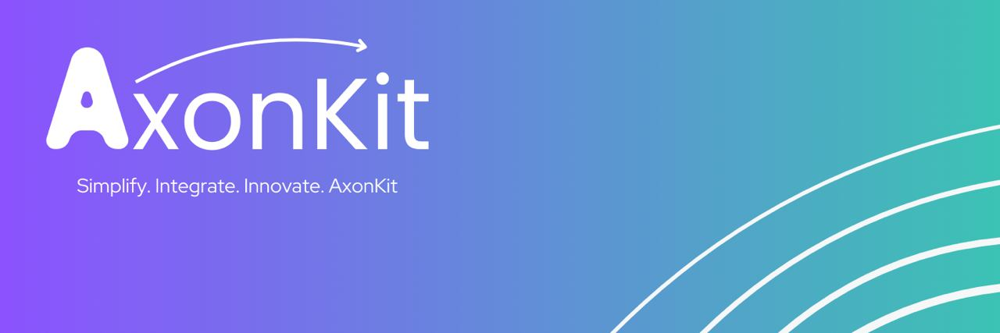

# AxonKit



AxonKit is a cutting-edge multi-language toolkit designed to simplify the creation, management, and execution of tools, particularly for integration with Solana projects and Large Language Models (LLMs). Built for developers by developers, AxonKit empowers you to build smarter, faster, and scalable tools with ease.

---

## 🚀 Features

### 🔧 Core Capabilities

- **Abstract Tool Interfaces**: Simplify tool creation with standardized structures for inputs, outputs, and metadata.
- **Toolkit Management**: Organize tools into collections for streamlined execution and reusability.
- **JSON Schema Support**: Validate and define function parameters and return types with built-in schema support.
- **Asynchronous Execution**: Handle non-blocking operations for high-performance applications.
- **Multi-Language Support**: Native compatibility with Go and Rust, adhering to idiomatic practices.
- **Scalability**: Designed to support projects of any size, from individual developers to large-scale ecosystems.

---

## 💡 Why AxonKit?

AxonKit is built to address the real-world challenges developers face when building tools and integrating with blockchain ecosystems like Solana. By leveraging AxonKit, you can:

- Accelerate your development process with pre-built interfaces and patterns.
- Reduce complexity with consistent JSON schema validation.
- Seamlessly integrate with Solana projects and other LLM-based workflows.
- Build with confidence, knowing that AxonKit is designed for scalability and performance.

---

## 🔨 Installation

### Go
Install AxonKit for Go projects:

```bash
go get github.com/axonkit/toolkit/go
```

### Rust
Add AxonKit to your Rust project:

```toml
[dependencies]
axonkit = { git = "https://github.com/axonkit/toolkit", subdirectory = "rust" }
```

---

## 📖 Usage

### Example: Go
Here's a quick example of defining and using a tool in Go:

```go
package main

import (
    "context"
    "encoding/json"
    "fmt"

    "github.com/axonkit/toolkit/go"
)

type HelloWorldTool struct{}

func (h *HelloWorldTool) Execute(ctx context.Context, input json.RawMessage) (json.RawMessage, error) {
    return json.RawMessage(`{"message":"Hello, World!"}`), nil
}

func (h *HelloWorldTool) Schema() (string, string) {
    return "{}", "{\"message\":\"string\"}"
}

func main() {
    manager := toolkit.NewToolManager()

    helloTool := &HelloWorldTool{}
    manager.RegisterTool("hello", helloTool)

    input := json.RawMessage(`{}`)
    output, err := manager.ExecuteTool("hello", context.Background(), input)
    if err != nil {
        fmt.Println("Error:", err)
        return
    }
    fmt.Println("Output:", string(output))
}
```

---

## 📊 Tokenomics

As part of the AxonKit ecosystem, we are introducing a token on Solana to support growth and sustainability. Here's the breakdown:

- **Total Supply**: 1 billion tokens
- **Allocation**:
  - 5%: Team buy-in, demonstrating confidence and commitment.
  - 2%: Marketing to drive adoption and visibility.
  - 2%: Development costs to enhance AxonKit features.
  - 1%: Collaboration fund for partnerships and integrations.

---

## 🌐 Roadmap

1. **Development**: Complete core functionality and release on GitHub.
2. **Token Launch**: Deploy AxonKit token via Pump.fun on Solana.
3. **Growth**: Expand features, foster partnerships, and engage with the community.
4. **Community**: Host hackathons, challenges, and collect user feedback.

---

## 🤝 Contributing

We welcome contributions! Here’s how you can get involved:

1. Fork the repository.
2. Create a branch for your feature or fix.
3. Submit a pull request with a detailed description of your changes.

---

## 📜 License

AxonKit is licensed under the MIT License. See the `LICENSE` file for details.

---

## 📫 Get in Touch

Have questions or feedback? We’d love to hear from you! Reach out to the AxonKit team or join the conversation on Solana forums and social media.


- **Twitter**: [@Axonkit](http://x.com/axonkit)
- **Website**: [Axonkit.xyz](http://axonkit.xyz)
